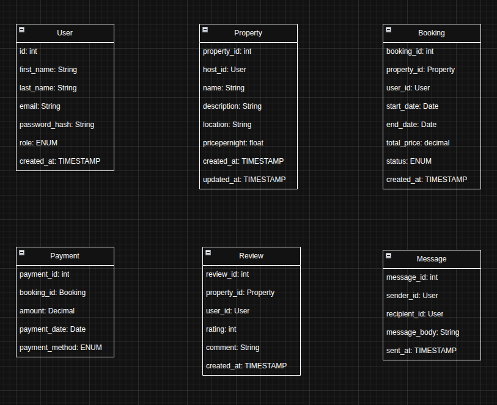

## Entities & Attributes

here are the main entities and their attribute:

### **User**

- `id` (PK)
- `name`
- `email`
- `phone`
- `role` (guest or host)
- `created_at`

### **Property**

- `id` (PK)
- `user_id` (FK → User)
- `title`
- `description`
- `location`
- `price`
- `created_at`

### **Booking**

- `id` (PK)
- `user_id` (FK → User)
- `property_id` (FK → Property)
- `start_date`
- `end_date`
- `status`

### **Payment**

- `id` (PK)
- `booking_id` (FK → Booking)
- `amount`
- `method`
- `status`

### **Review**

- `id` (PK)
- `user_id` (FK → User)
- `property_id` (FK → Property)
- `rating`
- `comment`

### **Message**

- `id` (PK)
- `sender_id` (FK → User)
- `recipient_id` (FK → User)
- `content`
- `sent_at`

# **Relationship Between Entities**

1. User to Property:
   - One user(which is referred as host) can list many properties.
   - The relationship here is 1 to Many
2. User to Booking:
   - One user (the user here is now referred as a Guest) can book many bookings
   - The relationship here also is One to Many.
3. Property to Booking:
   - One property can have many bookings.
   - This also is 1 to Many.
4. Booking to Payment:
   - One booking can have many payments (this is in the sense of instalmental or part payment).
   - this is also 1 to Many.
5. User to Review:
   - One user (the user here is the guest) can write many reviews. 
   - the relationship is 1 to Many.
6. Property to Review:
   - One property can have many Reviews.
   - The relationships 1 to Many.
7. User to Message:
   - One user(user here is the guest) can send many messages. 
   - Also One user (the user here is the host) can receive many messages
   - The relationship is 1 to Many.

# Airbnb ERD

Here is the Entity Relationship Diagram for the project:

