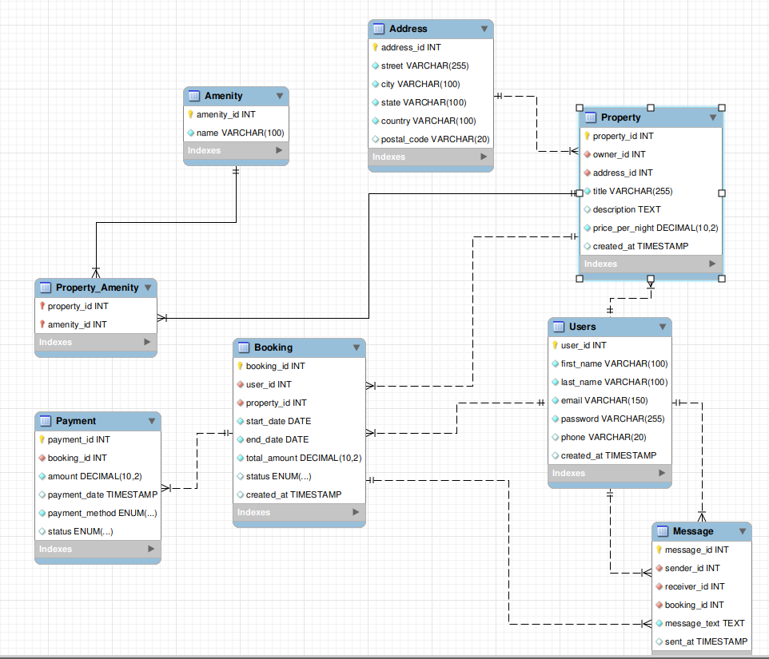

# An Explanation of My Normalization Steps:

I reviewed my schema to check for redundancies and violations of normalization principles.

- At first, the Property table included full address details (street, city, state, country). This was redundant because multiple properties could share the same city or country. To fix this, I moved those attributes into a separate Address entity and linked it to Property with a foreign key.

- I also identified that storing amenities directly inside the Property table (for example, columns like wifi, pool, parking) would violate normalization and create update anomalies. To fix this, I created an Amenity entity and a join table PropertyAmenity to represent the many-to-many relationship between properties and amenities.

With these adjustments, all attributes now depend only on the primary key, redundancies are eliminated, and the design is in Third Normal Form (3NF).

# ADJUSTED DATABASE DESIGN:

